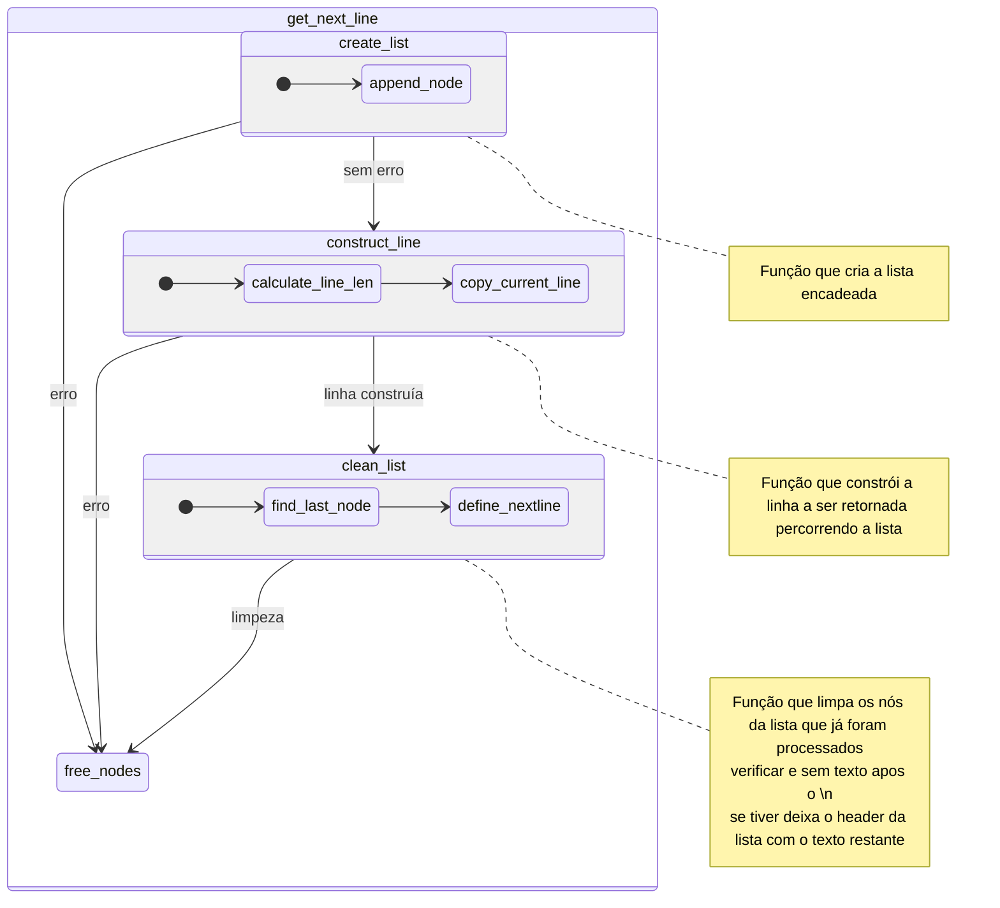

# get_next_line (Versão Linked List)
Este README tem como objetivo fornecer uma compreensão detalhada do funcionamento e do código da versão **Linked List** do **get_next_line**. As explicações gerais sobre o desafio e a metodologia de teste estão disponíveis na branch `main`. Aqui, focaremos exclusivamente na implementação e no funcionamento do código.

## 📋 Índice
- [Antes](#-antes-de-começar)
- [Explicação do Código](#explicação-do-código)
  - [get_next_line](#get_next_line)
  - [construct_line](#construct_line)
  - [create_list](#create_list)
  - [clean_list](#clean_list)
  - [found_new_line](#found_new_line)
  - [append_node](#append_node)
  - [find_last_node](#find_last_node)
  - [copy_current_line](#copy_current_line)
  - [free_nodes](#free_nodes)
- [Testes](#testes)

## 🚀 Antes de Começar
### O que é Linked List?
Uma linked list (ou lista encadeada) é uma estrutura de dados composta por uma sequência de nós, onde cada nó contém um valor e um ponteiro para o próximo nó. Essa estrutura permite alocações dinâmicas e não exige um tamanho pré-definido, ao contrário dos arrays. Para mais informações sobre linked lists, confira [este artigo](https://www.simplilearn.com/tutorials/c-tutorial/singly-linked-list-in-c).

Na nossa implementação do **get_next_line**, utilizamos a seguinte estrutura de linked list:

```c
typedef struct s_list
{
	char			*content;
	struct s_list	*next;
} t_list;
```

- `content`: Aponta para um bloco de dados lido do arquivo (em blocos de tamanho `BUFFER_SIZE`). Cada nó da lista contém uma parte dos dados lidos do descritor de arquivo.
- `next`: Aponta para o próximo nó na lista, formando a sequência de blocos lidos.

Essa estrutura nos permite armazenar os dados de forma fragmentada e eficiente, garantindo que os dados sejam processados e concatenados corretamente durante a leitura.

## 📜 Explicação do Código

Este fluxograma destaca o ciclo de leitura e construção da linha no **get_next_line**, garantindo que cada linha seja lida e retornada corretamente enquanto os dados são armazenados de forma eficiente em uma linked list.
Nesta seção, explicaremos detalhadamente cada função da implementação do **get_next_line** usando linked lists.

### ✨ `get_next_line(int fd)`
A função principal do projeto, `get_next_line`, é responsável por ler uma linha completa de um arquivo, utilizando um descritor de arquivo (fd). Ela utiliza uma lista encadeada para armazenar os dados lidos e processar a leitura até que um caractere de nova linha (`\n`) seja encontrado ou até o final do arquivo. A lista encadeada permite manter os dados lidos entre as chamadas, possibilitando que a leitura continue de onde parou.

### 📜 `construct_line(t_list *list)`
Esta função é responsável por construir a linha a ser retornada. Ela percorre a lista encadeada calculando o tamanho necessário e, em seguida, aloca memória para a linha. A função copia o conteúdo dos nós da lista até encontrar um caractere de nova linha (`\n`) ou chegar ao final. Dessa forma, `construct_line` gera a linha exata que deve ser retornada pela `get_next_line`.

### 💡 `create_list(t_list **list, int fd)`
A função `create_list` é a responsável por construir a lista encadeada que contém os blocos de dados lidos do arquivo. Ela utiliza a função `read()` para ler `BUFFER_SIZE` bytes do descritor de arquivo e cria novos nós na lista para armazenar cada parte dos dados. Esta função continua lendo até encontrar um caractere de nova linha (`\n`) ou chegar ao final do arquivo, garantindo que todo o conteúdo seja armazenado nos nós.

### 🔧 `clean_list(t_list **list)`
Após a linha atual ser construída e retornada, a função `clean_list` é utilizada para limpar os nós da lista que já foram processados. Ela garante que apenas os dados restantes, após a última linha lida, permaneçam na lista encadeada. Assim, essa função evita vazamentos de memória e prepara a lista para armazenar os próximos blocos de dados que serão lidos.

### 🔍 `found_new_line(t_list *list)`
Esta função verifica se a lista contém um caractere de nova linha (`\n`). Ela percorre cada nó da lista e verifica se o conteúdo possui o caractere. Se encontrado, a função retorna `1`, caso contrário, retorna `0`. Isso ajuda a determinar quando a leitura deve parar e a linha deve ser construída.

### ➕ `append_node(t_list **list, char *buf)`
Adiciona um novo nó ao final da lista encadeada. O novo nó contém o conteúdo do buffer lido. Esta função é fundamental para construir a lista de forma dinâmica conforme os dados são lidos do arquivo.

### 🔚 `find_last_node(t_list *list)`
Encontra o último nó da lista encadeada. É usada para adicionar novos nós no final da lista, garantindo que os dados sejam adicionados na sequência correta.

### ✍️ `copy_current_line(t_list *list, char *current_line)`
Esta função copia o conteúdo dos nós da lista encadeada para a linha que será retornada. Ela percorre a lista e copia caractere por caractere até encontrar um `\n` ou até atingir o final dos dados armazenados. Dessa forma, a linha é construída com todos os dados necessários para ser retornada pela `get_next_line`.

### 🗑️ `free_nodes(t_list **list, t_list *next_node, char *next_line)`
Libera todos os nós da lista que foram processados. Também pode receber um novo nó (`next_node`) e conteúdo (`next_line`) para serem adicionados após a liberação dos nós anteriores, garantindo que apenas os dados necessários permaneçam. Isso evita vazamentos de memória e mantém a estrutura da lista pronta para novas leituras.

## 📊 Fluxograma do Funcionamento


## 🧪 Testes
Para facilitar os testes da função **get_next_line**, recomendamos o uso do script **tester_gnl.sh** fornecido, que permite testar a implementação de forma prática e automatizada. É importante saber que existem dois tipos de testes: simples e intercalado (múltiplos FDs - Bônus).

### 🚩 Explicação das Flags do `tester_gnl.sh`
O script **tester_gnl.sh** suporta as seguintes flags:

- `-bonus`: Executa o teste intercalado com múltiplos file descriptors (FDs).
- `-compile_bonus`: Compila apenas a versão bônus e a executa, útil para testar funcionalidades específicas da versão bônus.
- `-compare`: Compara a execução entre a versão regular e a bônus, mostrando as diferenças no comportamento com múltiplos FDs.

### 📋 Exemplos de Uso do `tester_gnl.sh`
- **SINTAXE:**
  ```bash
  ./tester_gnl.sh {BUFFER_SIZE} {-bonus} {-compile_bonus} {-compare}
  ```
- Para compilar a versão normal e executar o teste com múltiplos FDs intercalados:
  ```bash
  ./tester_gnl.sh -bonus
  ```
- Para compilar a versão bônus e executar o teste simples, definindo o BUFFER_SIZE igual a 10:
  ```bash
  ./tester_gnl.sh 10 -compile_bonus
  ```
- Para compilar a versão bônus e executar o teste com múltiplos FDs intercalados:
  ```bash
  ./tester_gnl.sh -compile_bonus -bonus
  ```
- Para comparar as versões regular e bônus:
  ```bash
  ./tester_gnl.sh -compare
  ```
  Isso permitirá ver a diferença no comportamento entre as duas versões, especialmente no que diz respeito ao suporte para múltiplos FDs.

